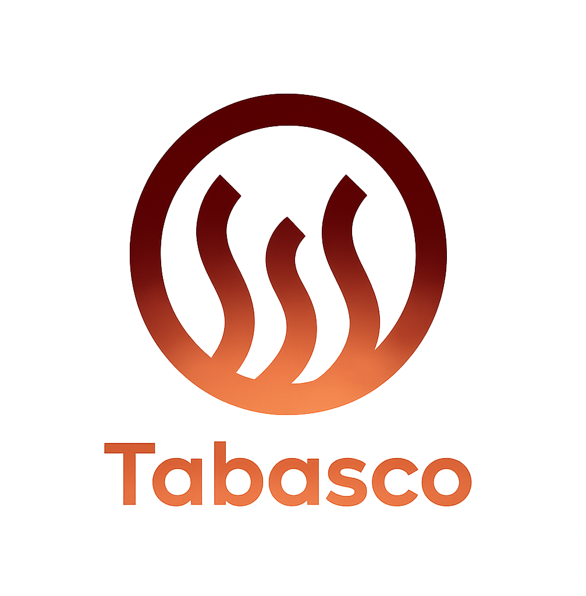
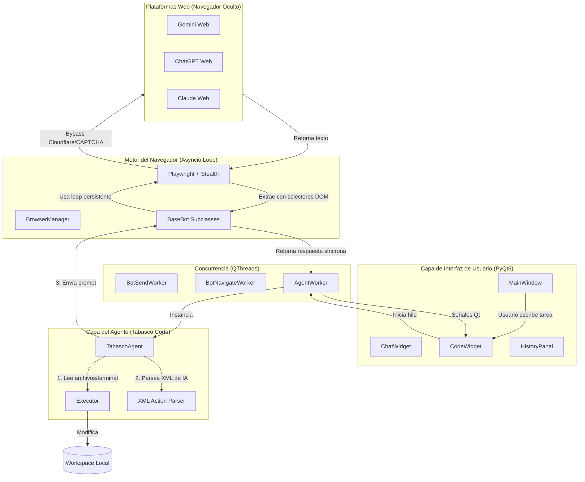

<p align="center">
  
</p>

<h1 align="center">TABASCO</h1>


<p align="center">
  <b>Terminal AI Bridge & Autonomous Coding Agent</b><br/>
  Un entorno de desarrollo híbrido de alto rendimiento que fusiona la potencia de los LLMs comerciales con tu sistema local, de forma 100% gratuita y sin consumo de API keys.
</p>

<p align="center">
  <br/>
  
  
  
  
</p>


---

## 🚀 ¿Qué es Tabasco?

Tabasco es una aplicación de escritorio diseñada para eliminar las barreras de las APIs de pago. Utiliza automatización avanzada de navegadores para convertir la interfaz web de chatbots populares (**Gemini, ChatGPT, Claude, Copilot, DeepSeek**) en un motor de backend local altamente disponible.

Con el módulo **Tabasco Code**, la aplicación pasa de ser un simple chat a convertirse en un **agente de codificación autónomo** (al estilo de *Claude Code* o *Antigravity*). La inteligencia artificial puede leer archivos, crear o sobreescribir código y ejecutar comandos de consola directamente dentro de una carpeta sandbox (Workspace) en tu PC.

---

## 🎨 Características Clave

* **🤖 Sin API Keys:** Interactúa con tus bots directamente a través de sus portales web.
* **🔐 Login Persistente y Seguro:** Las cookies y datos de sesión se guardan de forma aislada por bot en tu directorio de usuario (`.tabasco/profiles`). Solo inicias sesión una vez.
* **🕵️ Evasión Avanzada (Anti-detección):** Utiliza técnicas de ocultación (`playwright-stealth`) y patrones de interacción humanos para evitar bloqueos por Cloudflare, CAPTCHAs y sistemas de detección automatizada.
* **💻 Tabasco Code:** Un agente autónomo que opera en tu sistema. Tú le pides qué hacer, y él genera la estructura, escribe el código, corre los tests en la consola local, lee los errores y los soluciona solo.
* **📂 Workspace Aislado (Sandbox):** Fija una carpeta de trabajo. El agente tiene prohibido interactuar con cualquier directorio fuera de ella para proteger tu sistema de archivos.
* **💬 Interfaz Nivel Premium:** Diseñada en PyQt6 con estilos CSS oscuros estilo Cyberpunk, visualizador dinámico de burbujas ajustables en altura y un sistema visual de tarjetas colapsables para seguir las acciones del agente.

---

## 🏗️ Arquitectura de la Infraestructura

Tabasco utiliza una arquitectura híbrida de subprocesos aislados para mantener la seguridad y robustez en la comunicación con los bots web sin bloquear la interfaz de usuario en PyQt6.



### ¿Cómo funciona la emulación de entrada?
Para mensajes largos (como la inicialización del sistema de desarrollo del agente que supera los 2000 caracteres), escribir carácter por carácter simula un comportamiento humano, pero tardaría minutos. 

Tabasco soluciona esto inyectando el texto mediante `document.execCommand('insertText')` en el editor enriquecido (QuillJS) de la web. Esto engaña al editor web haciéndole creer que el usuario ha pegado el texto físicamente, disparando todos los listeners internos de la página web de manera instantánea y segura.

---

## 🔄 Flujo de Ejecución del Agente

Cuando solicitas una tarea en **Tabasco Code**, la infraestructura ejecuta el siguiente bucle continuo de razonamiento y acción:

```mermaid
sequenceDiagram
    autonumber
    actor Usuario
    participant CW as CodeWidget (GUI)
    participant TA as TabascoAgent (Thread)
    participant BOT as Bot Engine (Playwright)
    participant EXE as Executor (Workspace)

    Usuario->>CW: Escribe tarea ("Crea hello.py y ejecútalo")
    CW->>TA: Inicia AgentWorker
    Note over TA: Lee árbol de archivos local<br/>Genera Prompt de System en ASCII
    TA->>BOT: Envía prompt con contexto
    Note over BOT: Inyecta texto vía execCommand<br/>Emula click en "Enviar"
    BOT-->>TA: Retorna respuesta de la IA
    TA->>CW: Muestra razonamiento del bot
    
    rect rgb(20, 5, 5)
        Note over TA: Analiza tags XML <tabasco:*>
        TA->>EXE: Ejecuta acción (read/write/shell)
        Note over EXE: Valida que la ruta no intente salir del Workspace (Sandbox)
        EXE->>EXE: Crea/Modifica archivo o ejecuta comando en consola
        EXE-->>TA: Retorna resultado (código de salida, error o bytes escritos)
        TA->>CW: Añade Tarjeta de Acción (Card azul/ámbar/verde) en vivo
    end

    Note over TA: ¿Contiene <tabasco:done>? No
    TA->>BOT: Envía resultados de las acciones previas
    BOT-->>TA: Retorna nueva respuesta
    Note over TA: ¿Contiene <tabasco:done>? Sí
    TA-->>CW: Tarea terminada con éxito (Card verde brillante)
    CW-->>Usuario: Muestra reporte final y libera el input
```



---

## 📦 Dependencias y Requisitos del Sistema

Tabasco se basa en un ecosistema Python moderno. Las dependencias principales declaradas en `requirements.txt` son:

* **`PyQt6`**: El framework industrial utilizado para toda la interfaz gráfica de usuario.
* **`playwright`**: El motor de automatización Chromium de última generación con soporte para Shadow DOM.
* **`playwright-stealth`**: Middleware que inyecta scripts evasores para ocultar la firma del navegador.
* **`qasync`**: Permite la coexistencia del loop de eventos asíncronos de Python (`asyncio`) con el de la interfaz gráfica de Qt (`QEventLoop`).
* **`markdown`** y **`pygments`**: Para renderizar las respuestas de los bots con formato enriquecido y resaltado de sintaxis de código.

---

## 🛠️ Instalación y Puesta en Marcha

### Requisitos Previos
* **Python 3.10 o superior** instalado en el sistema.
* Sistema Operativo Windows 10 o 11 (recomendado).

### Pasos de Instalación
Abre una terminal en el directorio del proyecto y ejecuta:

```powershell
# 1. Instalar las dependencias de Python
pip install -r requirements.txt

# 2. Instalar el binario de Chromium de Playwright
python -m playwright install chromium

# 3. Comprobar que los imports y dependencias estén correctos
python scripts/check_imports.py

# 4. Iniciar la aplicación
python main.py
```

---

## 📂 Uso del Modo Agente (Tabasco Code)

1. Selecciona un bot de la barra lateral y conéctalo (si es la primera vez, haz login en la ventana emergente).
2. Haz clic en el botón superior **`💻 Código`** para entrar al panel del agente.
3. Haz clic en **`📂 Cambiar carpeta`** y define tu directorio del proyecto.
4. Escribe la tarea y pulsa **Enter**.
5. **Monitorea las acciones:** el panel mostrará en tiempo real qué archivos está abriendo, modificando o qué comandos ejecuta en tu terminal con tarjetas visuales interactivas:
   * 📖 **Tarjeta Azul:** Lectura de archivos.
   * ✏️ **Tarjeta Verde:** Escritura/Creación de código.
   * 🖥️ **Tarjeta Ámbar:** Comando ejecutado en consola local.
   * ✅ **Tarjeta Verde Brillante:** Tarea terminada.

---

## 📄 Licencia

Este software se distribuye bajo una **Licencia de Software Propietario**. El código fuente y la arquitectura son de uso exclusivamente personal y privado. Queda prohibida su reproducción, redistribución o explotación comercial no autorizada. Consulta el archivo [LICENSE](LICENSE) para más detalles.

Desarrollado y mantenido por **amglogicalis** &copy; 2026.

